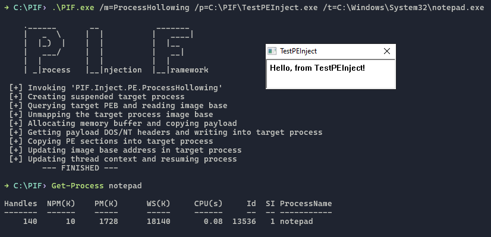

# PIF (Process Injection Framework)
PIF is a tool that facilitates injecting & executing arbitrary code in remote processes through various process injection techniques.



---

## Usage
### PIF supports three different execution methods:
1. Standard execution.
```
> .\PIF.exe /arg1=x /arg2=y /arg3=z
```
2. In-memory in PowerShell.
```
> $pifBytes = [IO.File]::ReadAllBytes("C:\PIF.exe")
> [System.Reflection.Assembly]::Load($pifBytes)
> [PIF.PIFStandardExec]::Main("/arg1=x /arg2=y /arg3=z").Split())
```
3. Proxy execution through [InstallUtil (MITRE T1218.004)](https://attack.mitre.org/techniques/T1218/004/).
```
> .\InstallUtil.exe /LogFile= /LogToConsole=False /U /arg1=x /arg2=y /arg3=z C:\PIF.exe
```

### Methods
*If there are any other techniques you would like to see covered here, please feel free to create an issue and let me know!*
| Shellcode          | DLL         | PE               |
|--------------------|-------------|------------------|
| CreateRemoteThread | LoadLibrary | ProcessHollowing |
| EarlyBirdAPC       |             |                  |
| QueueUserAPC       |             |                  |
| ThreadHijacking    |             |                  |